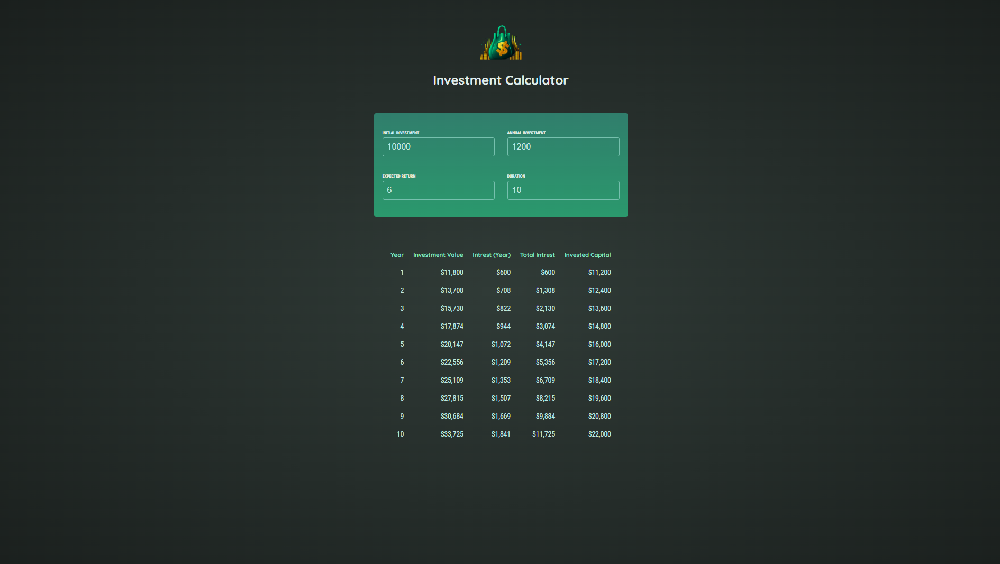

# 💸 Investment Calculator

A simple investment calculator web app built with **React**. This project was created as a **practice project** based on a course on **Udemy**.

🔗 **Live Demo:** [investment-calculator-arunav.netlify.app](https://investment-calculator-arunav.netlify.app/)

---

## 📸 Screenshots

> 

---

## ✨ Features

- ✅ Calculate future investment value based on initial investment, annual investment, expected return, and duration.
- ✅ Interactive and user-friendly interface.
- ✅ Real-time calculation as you input values.
- ✅ Clear breakdown of yearly growth.

---

## 🔧 Technologies Used

- ⚛️ **React** (Components, State, Props)
- 💅 **CSS** for styling
- 🌐 **Netlify** for deployment

---

## 🎯 Learning Takeaways

- 🎉 Strengthened understanding of React component structure and state management.
- 🚀 Improved CSS styling and form handling skills.
- 🔥 Gained experience in deploying React apps on Netlify.

---

## 📚 Credits

This project is based on a [React course](https://www.udemy.com/course/react-the-complete-guide-incl-redux/) from [Udemy](https://www.udemy.com/) — special thanks to the [instructor](https://www.udemy.com/user/maximilian-schwarzmuller/) for the learning experience!

---

Happy coding! 🚀✨
